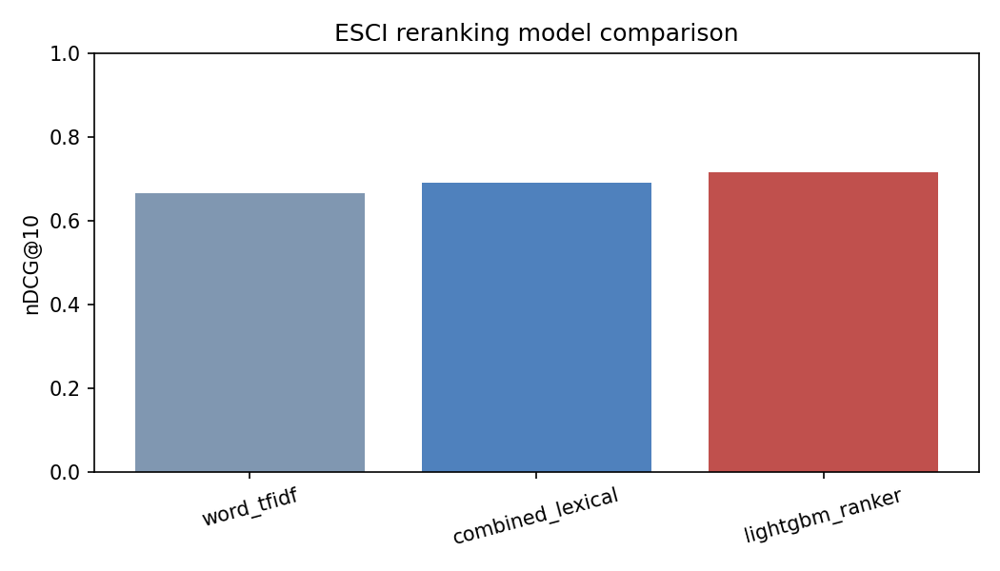
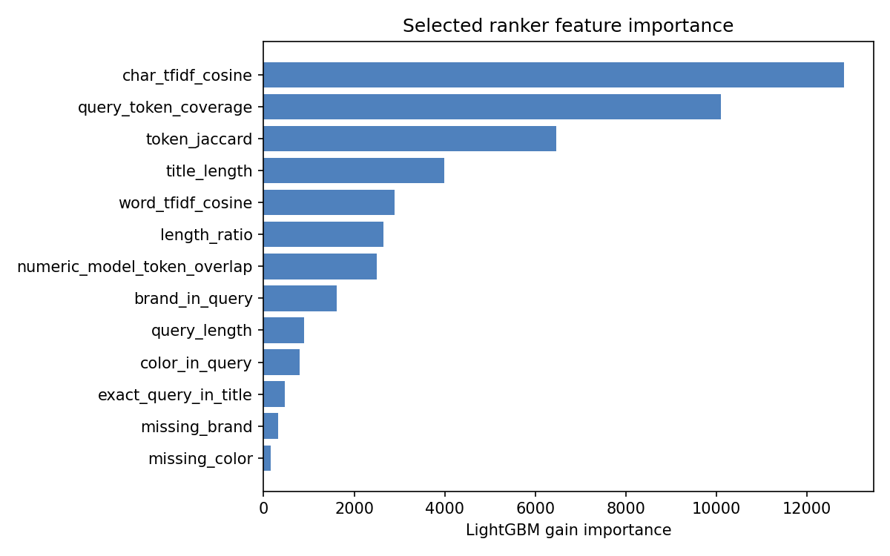
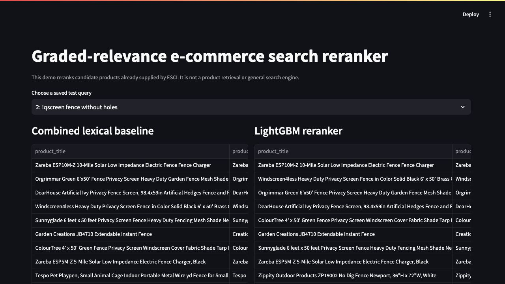

# Graded-Relevance E-commerce Search Reranker

Product search must distinguish the requested product from substitutes, accessories, and unrelated items that happen to share keywords. This project reranks candidate products from Amazon's ESCI Shopping Queries dataset using graded relevance and query-grouped learning.

On a previously uninspected, fresh-to-project holdout of 7,956 US queries, the selected LambdaRank model reached **0.7158 nDCG@10**, compared with **0.6914** for the validation-selected lexical baseline. The absolute change was **+0.0244** and the relative change was **+3.53%**. A paired query bootstrap gave a 95% confidence interval of **[+0.0213, +0.0275]**, demonstrating an nDCG improvement on this offline candidate-ranking task.

This is reranking over candidates already supplied by ESCI, not a retrieval engine. It cannot return a product absent from the candidate set.

## Approach

The pipeline uses the official reduced Task 1 data (`small_version == 1`) for the US locale. Its three methods are:

1. word TF-IDF cosine similarity between query and product title;
2. a validation-selected word/character TF-IDF blend;
3. LightGBM LambdaRank over either those two lexical features or all 13 compact lexical and metadata-match features.

TF-IDF is fitted only on sampled training queries and titles. Labels, split, row order, source, and identifiers are not model features. `product_id` is used only as an explicit deterministic tie-breaker: score descending, then product ID ascending.

LambdaRank is appropriate because the goal is to order candidates within each query, not classify independent query-product rows. Training and evaluation therefore preserve query groups, and reported metrics give each query equal weight.

nDCG uses the shared gains `I=0.0`, `C=0.01`, `S=0.1`, and `E=1.0`. The other metrics are Exact MRR@10, Exact-or-Substitute Recall@5, Complement Exposure@5, and Irrelevant Exposure@5. Recall is undefined and excluded from its mean for a query containing no Exact or Substitute candidate; all 7,956 final queries were eligible in this run.

## Evaluation protocol

The published official test labels had previously been inspected for the legacy seed-42 sample, so those queries are no longer the canonical evaluation set. The pipeline deterministically reconstructs and excludes them without hardcoding IDs.

| Partition | Queries | Candidate rows | Use |
|---|---:|---:|---|
| Train | 5,000 | 100,787 | Fit TF-IDF and rankers |
| Validation | 1,000 | 20,207 | Select lexical weight, ranker candidate, early stopping, and slice threshold |
| Excluded legacy test | 1,000 | 20,013 | Reconstructed only; never used for the new results |
| Fresh final test | 7,956 | 161,688 | One evaluation after validation selection was frozen |

The official US reduced split contains 20,888 train and 8,956 test queries. Sampling seed, model seed, and bootstrap seed are recorded separately as `42`, `42`, and `2029`. No losing ablation candidate is evaluated on the fresh final set.

### Validation-only ablation

Every candidate used the same 5,000 training queries, 1,000 validation queries, label gains, and validation early stopping. The fitted validation winner was retained without refitting.

| Candidate | Features | Truncation | Validation nDCG@10 | Best iteration |
|---|---|---:|---:|---:|
| `tfidf_2_trunc13` | Word + character TF-IDF | 13 | 0.6900 | 25 |
| **`all_13_trunc13`** | **All 13 features** | **13** | **0.7180** | **108** |
| `all_13_trunc30` | All 13 features | 30 | 0.7154 | 89 |

The combined lexical baseline independently selected word weight `0.25` using validation nDCG@10.

## Fresh final results

| Method | nDCG@10 | Exact MRR@10 | E/S Recall@5 | Complement Exposure@5 | Irrelevant Exposure@5 | p50 ms | p95 ms |
|---|---:|---:|---:|---:|---:|---:|---:|
| Word TF-IDF | 0.6665 | 0.7117 | 0.3065 | 0.0477 | 0.1239 | 1.61 | 2.16 |
| Combined lexical | 0.6914 | 0.7403 | 0.3133 | 0.0486 | 0.1135 | 3.40 | 6.21 |
| **Selected LambdaRank** | **0.7158** | **0.7763** | **0.3144** | **0.0471** | **0.1123** | **4.15** | **7.41** |

Against combined lexical:

- nDCG@10 changed by **+0.0244 absolute** and **+3.53% relative**. Its paired 95% CI was **[+0.0213, +0.0275]**, demonstrating improvement for nDCG.
- Exact MRR@10 changed by **+0.0360 absolute** and **+4.86% relative**. Its paired 95% CI was **[+0.0297, +0.0425]**, independently demonstrating improvement for MRR.
- E/S Recall@5 changed by only **+0.0012 absolute** (+0.37% relative).
- Complement Exposure@5 fell by 0.0015 and Irrelevant Exposure@5 fell by 0.0013.

At query level, nDCG improved for **4,212 queries (52.94%)**, tied for **641 (8.06%)**, and worsened for **3,103 (39.00%)**. The confidence intervals quantify the paired mean changes; the win/tie/loss counts show that aggregate improvement does not mean every query improved.

Full-precision results are in [`reports/metrics.json`](reports/metrics.json), [`reports/model_comparison.csv`](reports/model_comparison.csv), [`reports/per_query_metrics.csv`](reports/per_query_metrics.csv), and [`reports/bootstrap_comparison.csv`](reports/bootstrap_comparison.csv).



### Quantitative slices

The slice definitions are fixed before final evaluation. Low overlap means mean candidate query-token coverage at or below the validation-set bottom quartile.

| Slice | Queries | Combined lexical nDCG@10 | LambdaRank nDCG@10 | Absolute change |
|---|---:|---:|---:|---:|
| One or two tokens | 1,534 | 0.7059 | 0.7301 | +0.0242 |
| Contains number/model token | 1,624 | 0.6414 | 0.6942 | +0.0528 |
| Five or more tokens | 2,384 | 0.6735 | 0.6986 | +0.0252 |
| Low lexical overlap | 1,856 | 0.6637 | 0.6753 | +0.0116 |

Numeric/model-token queries showed the largest gain; low-overlap queries remained the weakest improvement slice. Complete slice metrics are in [`reports/query_slice_metrics.csv`](reports/query_slice_metrics.csv).

## Illustrative error analysis

These cases were selected automatically after final evaluation using per-query nDCG differences. The largest win and regression are deliberately extreme illustrations, not representative aggregate evidence. The middle case is nearest the median positive difference. [`reports/error_examples.csv`](reports/error_examples.csv) contains every candidate, method, rank, label, and score for all three queries.

### Largest improvement: “fitbit charge 3” (nDCG difference +0.9739)

The lexical ranking overweights exact phrase overlap in accessory titles, placing Complement bands in all top-five positions. The ranker uses the additional match and length signals to move Exact tracker products into the top five.

Combined lexical:

| Rank | Product | Label | Title |
|---:|---|:---:|---|
| 1 | `B084HLHC4Q` | C | Adepoy Compatible with Fitbit Charge 3 Bands, black |
| 2 | `B08741P5CZ` | C | ANATYU metal bands compatible with Fitbit Charge 3/4 |
| 3 | `B0861G538Q` | C | Adepoy stainless-steel wristband for Fitbit Charge 3 |
| 4 | `B085FZ5HT2` | C | poshei replacement bands for Fitbit Charge 3/4 |
| 5 | `B085G7VSGW` | C | poshei replacement bands for Fitbit Charge 3/4 |

Selected LambdaRank:

| Rank | Product | Label | Title |
|---:|---|:---:|---|
| 1 | `B07G26PDJQ` | E | Fitbit Charge 3 Fitness Activity Tracker, graphite/black |
| 2 | `B07G18N2YY` | E | Fitbit Charge 3 Fitness Activity Tracker, rose gold/blue grey |
| 3 | `B07QN22K3V` | E | Fitbit Charge 3 Fitness Activity Tracker, renewed |
| 4 | `B07P5XHCHJ` | E | Fitbit Charge 3 Fitness Watch kit |
| 5 | `B07GB2LMDF` | E | Fitbit Charge 3 Fitness Activity Tracker, rose gold/berry |

### Representative positive: “paint car prank” (nDCG difference +0.0812)

The lexical baseline ranks an Irrelevant snake prank first. The ranker identifies Exact spray-chalk and bumper-magnet products, although the same snake false match remains second and shows the limits of these shallow features.

Combined lexical:

| Rank | Product | Label | Title |
|---:|---|:---:|---|
| 1 | `B07HKJ2W39` | I | Realistic snake toy for Halloween prank props |
| 2 | `B07KWHVPD5` | E | Prank bumper-sticker variety pack |
| 3 | `B01LZ421UX` | E | Bumper-sticker magnetizer sheets |
| 4 | `B01J4AK5B0` | E | Prank bad-parking bumper stickers |
| 5 | `B08772Y74J` | E | Bigfoot car air fresheners and decal |

Selected LambdaRank:

| Rank | Product | Label | Title |
|---:|---|:---:|---|
| 1 | `B01HDYBMYS` | E | Testors Spray Chalk, 4 Count |
| 2 | `B07HKJ2W39` | I | Realistic snake toy for Halloween prank props |
| 3 | `B00CW1PWT4` | E | Prank magnetic bumper sticker |
| 4 | `B01LZ421UX` | E | Bumper-sticker magnetizer sheets |
| 5 | `B07KWHVPD5` | E | Prank bumper-sticker variety pack |

### Largest regression: “ifuser” (nDCG difference −1.0000)

The misspelled query appears to mean “infuser.” Character similarity lets the lexical baseline put the single Exact tea infuser first, while the learned ranker favors the many superficially similar but Irrelevant oil diffusers. This is an illustrative failure of the handcrafted signals under a short typo.

Combined lexical:

| Rank | Product | Label | Title |
|---:|---|:---:|---|
| 1 | `B079BJNM8D` | E | House Again tea ball and cooking infuser |
| 2 | `B018CLNEOM` | I | VicTsing essential-oil diffuser |
| 3 | `B082796J3V` | I | Aroma diffuser and essential-oil set |
| 4 | `B07XQLGKXY` | I | Aromatherapy diffuser and essential-oil set |
| 5 | `B01N7IZ4BZ` | I | VicTsing mini aroma diffuser |

Selected LambdaRank:

| Rank | Product | Label | Title |
|---:|---|:---:|---|
| 1 | `B0794LRNW3` | I | Breathe essential-oil diffuser |
| 2 | `B079V6NZ57` | I | Aromatherapy essential-oil diffuser set |
| 3 | `B07D48G4RP` | I | Anjou ultrasonic aromatherapy diffuser |
| 4 | `B07ZZKSM3M` | I | Kingsley essential-oil diffuser |
| 5 | `B074QGWYHX` | I | Everlasting Comfort essential-oil diffuser |

## Latency protocol

Latency is warmed-up, per-query candidate scoring on the same 7,956 groups for every method. Each timed call includes candidate preparation, only the method's required features, scoring, and deterministic sorting. Data loading, artifact loading, and model loading are excluded. LightGBM prediction is fixed to one thread.

The reported run used Python 3.9.6, LightGBM 4.5.0, scikit-learn 1.5.2, and macOS arm64. Mean candidate count was 20.32. Latency is hardware- and software-dependent and should not be treated as a service-level guarantee.

Feature importance is LightGBM gain importance for the selected fitted model. It is descriptive and non-causal: these lexical and match features are correlated, so importance cannot be interpreted as an isolated feature effect.



## Setup and run

The run was verified with Python 3.9.6 and the pinned dependencies.

```bash
python3 -m venv .venv
source .venv/bin/activate
python -m pip install -r requirements.txt
```

Download the official files from the [Amazon ESCI repository](https://github.com/amazon-science/esci-data/tree/main/shopping_queries_dataset) into `data/`:

```bash
mkdir -p data
test -f data/shopping_queries_dataset_examples.parquet || curl -L --fail -o data/shopping_queries_dataset_examples.parquet https://media.githubusercontent.com/media/amazon-science/esci-data/main/shopping_queries_dataset/shopping_queries_dataset_examples.parquet
test -f data/shopping_queries_dataset_products.parquet || curl -L --fail -o data/shopping_queries_dataset_products.parquet https://media.githubusercontent.com/media/amazon-science/esci-data/main/shopping_queries_dataset/shopping_queries_dataset_products.parquet
```

The two parquet files total approximately 1.16 GB (1.08 GiB). With data already present, the verified complete pipeline—including ablation, final scoring, 23,868 latency measurements, reports, and artifact-reload verification—took **152 seconds** and reached approximately **2.13 GiB peak RSS** on the machine described above. Dependency installation and download time are additional.

```bash
python run_pipeline.py --config config.yaml
python -m pytest -q
streamlit run app.py --server.headless true -- --config config.yaml
```

The app checks for required artifacts and gives the pipeline command if they are missing. The selected bundle and ranker were reloaded after the real run and reproduced all saved scores, deterministic ranks, and ordering.



## Limitations

- Candidate products are supplied by the dataset, so retrieval recall is not measured.
- ESCI labels are relevance judgments, not clicks, conversions, or revenue.
- The fresh holdout is previously uninspected by this project, not a private or hidden benchmark.
- The model uses shallow lexical and metadata-match signals; it has no semantic embeddings and remains vulnerable to typos and ambiguous intent.
- It does not use live price, availability, inventory, images, descriptions, or personalization.
- Only the US English reduced subset is evaluated.
- Bootstrap intervals describe uncertainty across these labeled query groups; offline improvements do not guarantee online customer or business impact.

## Dataset citation and licences

The dataset is described in *Shopping Queries Dataset: A Large-Scale ESCI Benchmark for Improving Product Search* by Reddy et al. The [upstream ESCI repository](https://github.com/amazon-science/esci-data) is published under Apache-2.0; the data are downloaded separately and are not redistributed here.

This project's source code is licensed under the [MIT License](LICENSE).
